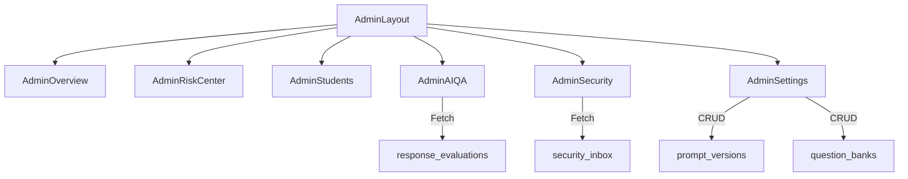

# 系统设计方案 (SOP Phase 2: Design & Blueprint)

## 1. AI 质量审计 (AI Quality Audit)
**页面：** `/admin/ai-qa`
**核心指标 (KPIs)：**
- **平均共情得分** (empathy_score)
- **回复专业度** (professionalism_score)
- **内存/知识库利用率** (memory_utilization)
- **对话成功转换率** (基于后续心情评分)

**UI 结构：**
- 顶部：四个核心维度雷达图 + 质量分布柱状图。
- 中部：低分回话预警列表 (Score < 70)。
- 列表项：点击展开查看完整对话快照及 AI 具体的自评（Json 内容解析展示）。

## 2. 安全审计 (Security Audit)
**页面：** `/admin/security`
**数据流：** `security_inbox` -> `Real-time Dashboard`
**核心功能：**
- **风险事件流**：类似于 Github Actions 的实时日志输出，标高危 (Critical) 事件。
- **危机画像**：展示风险分值 `risk_score` 变化曲线。
- **处置工具箱**：标记为“处理中”、“已结案”、“转人工”。

## 3. 系统配置 (System Settings)
**页面：** `/admin/settings`
**核心模块：**
- **提示词容器**：可视化编辑 `prompt_versions.content`。支持版本回滚。
- **题库策略**：通过 `priority` 调整 `question_banks` 的出题频率。
- **接口监控**：Supabase API 负载与错误率实时展示。

---

## 4. 路由与架构图 (Mermaid)

